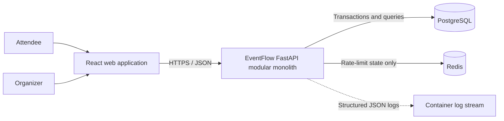
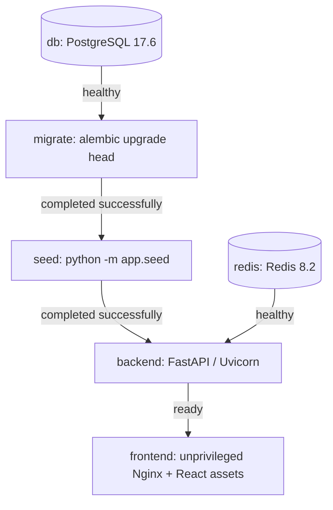
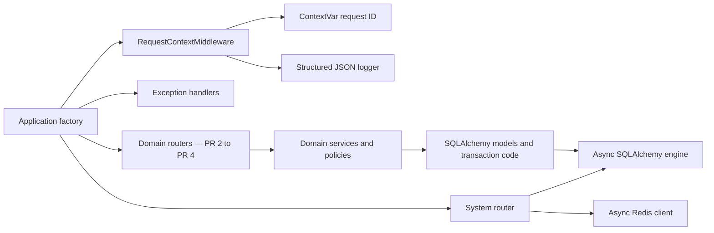
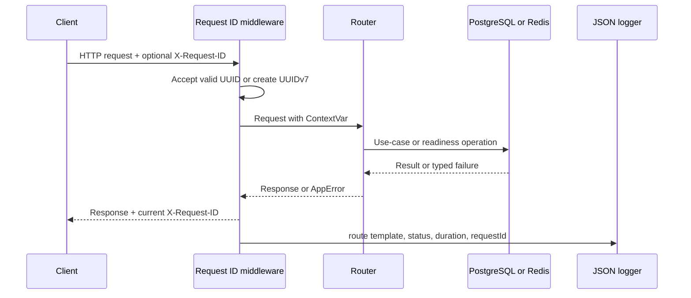
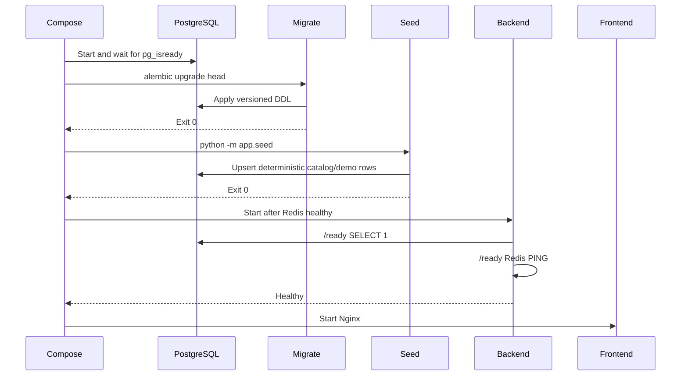
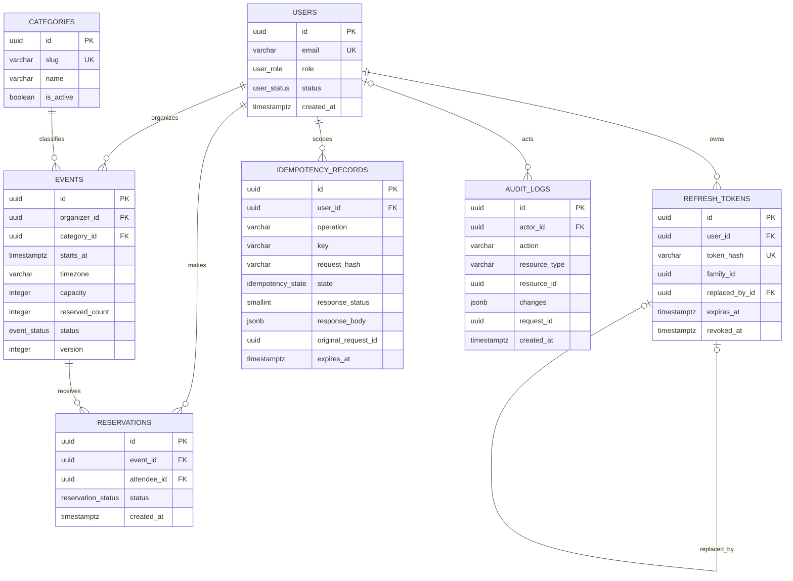
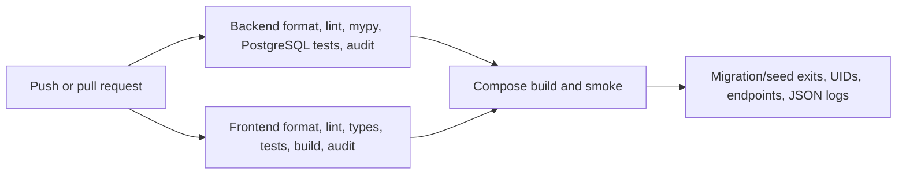

# EventFlow Architecture

Bu belge çalışan sistemin mimarisini açıklar. PR 1 itibarıyla foundation, şema, migration/seed, system endpointleri ve delivery pipeline gerçektir; auth/event/reservation use-case'leri ilgili sonraki PR'larda eklenecektir.

## Mimari hedefler

- Tek deploy edilebilir backend içinde açık domain sınırları olan modüler monolit.
- PostgreSQL constraint, transaction ve row-lock özelliklerini veri bütünlüğünün son savunma hattı olarak kullanmak.
- Şemayı yalnız Alembic ile değiştirmek; uygulama startup'ında otomatik şema üretmemek.
- Lokal geliştirme, test ve CI arasında aynı image ve migration/seed sırasını korumak.
- Authorization, idempotency, concurrency ve audit kurallarını UI'dan bağımsız server-side uygulamak.
- Request ID, ortak error envelope, structured JSON log ve readiness'i bütün modüllerin ortak altyapısı yapmak.

## Sistem bağlamı



Redis domain verisinin kaynağı değildir. Kullanıcılar, etkinlikler, rezervasyonlar, idempotency snapshot'ları ve audit kayıtları PostgreSQL'de tutulur.

## Container görünümü



`migrate` ve `seed` one-shot container'lardır. Backend ile aynı image'ı kullanırlar, böylece migration kodu ile runtime model sürümü ayrışmaz. PostgreSQL named volume kullanır; Redis PR 1'de persistence kapalıdır çünkü ileride yalnız geçici rate-limit state'i taşıyacaktır.

Backend runtime UID/GID `10001:10001`, frontend runtime UID/GID `101:101`'dir. Her iki Dockerfile multi-stage build kullanır ve compiler/package-manager araçlarını runtime image'a taşımaz.

## Backend bileşenleri



Modül sınırları:

| Modül | Sorumluluk | PR 1 durumu |
|---|---|---|
| `shared` | Fail-fast config, async DB base/session altyapısı, ortak hata modeli | Çalışıyor |
| `observability` | Request ID, JSON logging, `/health`, `/ready` | Çalışıyor |
| `users` | User persistence, rol/statü enum'ları | Şema hazır |
| `auth` | Refresh-token persistence ve ileride rotation/replay | Şema hazır; use-case PR 2 |
| `categories` | Seed edilmiş kategori kataloğu | Şema ve seed hazır; API PR 3 |
| `events` | Event persistence ve ileride owner/public lifecycle | Şema hazır; use-case PR 3 |
| `reservations` | Reservation persistence ve ileride kapasite transaction'ları | Şema hazır; use-case PR 4 |
| `idempotency` | Request ownership ve semantic response snapshot'ı | Şema hazır; algoritma PR 4 |
| `audit` | Kritik değişikliklerin immutable kaydı | Şema/DB trigger hazır; writer'lar PR 3-4 |

`backend/app/models.py`, bütün modelleri Alembic metadata için import eder; domain davranışı içeren bir “god model” değildir.

## HTTP request akışı



Geçerli UUID request header'ı korunur; eksik/geçersiz değer için UUIDv7 üretilir. Hata handler'ı şu semantiği korur:

```json
{
  "error": {
    "code": "DEPENDENCIES_NOT_READY",
    "message": "Uygulama bağımlılıkları henüz hazır değil.",
    "details": [],
    "requestId": "0198..."
  }
}
```

Beklenmeyen exception ayrıntısı client'a sızdırılmaz. Log kaydı route template kullanır; ham UUID path değerleriyle log cardinality büyütülmez.

## Startup, migration ve seed akışı



Migration tekrar `upgrade head` aldığında yeni revision olmadığı için no-op olur. Seed kararlı UUID ve doğal anahtarlarla upsert yapar; iki çalıştırma aynı satır sayılarını korur. Seed migration içine gömülmez, çünkü demo/katalog veri yaşam döngüsü şema yaşam döngüsünden ayrıdır.

## Veri modeli



### Veritabanı invariantları

- `events.reserved_count` sıfırdan küçük ve `capacity` değerinden büyük olamaz.
- `(reservations.event_id, reservations.attendee_id)` unique'tir. İptal aynı satırın statü geçişidir; rebook yeni duplicate satır üretmez.
- Refresh token hash'i unique ve SHA-256 hex uzunluğundadır; replacement kendi satırını gösteremez.
- `(user_id, operation, key)` yalnız bir idempotency sahibi oluşturur.
- Idempotency `PROCESSING` satırında response alanları boş; `COMPLETED` satırında status, body ve original request ID zorunludur.
- Audit satırına `UPDATE` veya `DELETE`, PostgreSQL trigger tarafından koşulsuz reddedilir.
- Domain foreign key'lerinde bilinçli olarak cascade delete kullanılmaz; tarihçe sessizce kaybolamaz.

Bu constraint'ler tek başına use-case algoritması değildir. Event-first lock order, idempotency takeover/replay ve same-transaction audit writer'ları PR 3-4'te uygulanıp concurrency testleriyle kanıtlanacaktır.

## İndeksler ve maliyetleri

| İndeks/constraint | Hedef sorgu veya invariant | Bedel |
|---|---|---|
| `users.email` unique | Login ve kayıt duplicate kontrolü | User write'ında ek B-tree bakımı |
| `refresh_tokens.token_hash` unique | Opaque refresh lookup ve replay tekilliği | Her rotation'da unique-index write |
| `(refresh_tokens.user_id, expires_at)` | Kullanıcı bazlı expired cleanup | Token write alanı |
| `(refresh_tokens.family_id, revoked_at)` | Replay halinde family-wide revoke | Rotation/revoke write alanı |
| Active event `(starts_at, id)` partial | Public cursor sıralaması | Aktif event update'lerinde bakım |
| Event `(organizer_id, created_at, id)` | Owner-scoped liste/detail akışı | Event write alanı |
| Reservation `(event_id, attendee_id)` unique | Duplicate reservation engeli | Rezervasyon create/rebook kontrol maliyeti |
| Reservation attendee history | Kullanıcının cursor geçmişi | Reservation statü update'inde bakım |
| Reservation event/status | Organizer attendee listesi ve bulk transition | Status geçişlerinde bakım |
| Idempotency `(user_id, operation, key)` unique | Concurrent claim/replay | Her idempotent işlemde write contention |
| Idempotency `expires_at` | Retention cleanup | Snapshot write alanı |

PR 3 ve PR 4 gerçek sorguları eklediğinde `EXPLAIN (ANALYZE, BUFFERS)` kanıtı üretilecek. Erken genel amaçlı indeks eklenmedi; her indeks bir sorgu veya invariant ile ilişkilidir.

## Güvenlik sınırları

- Browser güvenilir değildir; access claim rolü aktif kullanıcı DB rolüyle backend'de tekrar doğrulanır ve ownership domain sorgularında ayrıca scope edilir.
- Başkasına ait UUID resource erişimi, varlığı gizlemek için `404`; genel capability reddi gerekirse `403` kullanır.
- Access token kısa ömürlü JWT; refresh token opaque ve yalnız hash'i saklanan rotating credential'dır. Replay aynı token family'yi kapatır.
- CORS wildcard kabul etmez; exact allowlist ve cookie endpointlerinde exact Origin kontrolü kullanır.
- Zorunlu env ve secret kuralları startup'ta fail-fast uygulanır.
- Audit ve idempotency response'larında secret/PII kapsamı minimize edilir; log formatter yalnız allowlist alanlarını üretir.
- Local demo credentials production için uygun değildir ve production demo JWT secret'ını reddeder.

## Concurrency tasarım sınırı

PR 1 şeması kapasiteyi son savunma hattında korur. PR 4 writer sırası değişmez olacaktır:

```text
create/rebook: idempotency row -> event -> reservation -> audit -> idempotency finalize
cancel: non-locking ownership lookup -> event -> reservation -> audit
```

Event satırı kapasite sayacının serialization point'idir. Cancellation reservation'ı event'ten önce kilitlemez; böylece ters kilit sırası ve deadlock riski önlenir. Kritik domain mutasyonu, sayaç, audit ve idempotency finalize aynı PostgreSQL transaction'ında kalır.

## Ölçek ve evrim

Modüler monolit ilk teslim için network hop, dağıtık transaction ve operasyon maliyetini azaltır. Stateless backend container'ı yatay çoğaltılabilir; doğruluk PostgreSQL transaction/unique constraint/row lock'larına dayanır. Redis yalnız paylaşılan rate-limit state'i sağlar.

İlk darboğazların event row contention, public liste sorguları ve idempotency retention olması beklenir. Ölçüm olmadan mikroservise bölünmez. Daha büyük ölçekte queue/waiting-room, reconciliation ve partition/archival değerlendirilebilir; bunlar mevcut P0-P2 kapsamı değildir.

## CI güven zinciri



Migration testleri disposable PostgreSQL Testcontainer kullanır; geliştiricinin lokal DB'sine bağlanmaz. CI ayrıca runtime `create_all` çağrısını kaynak taramasıyla reddeder ve Docker image kullanıcılarını kontrol eder.
