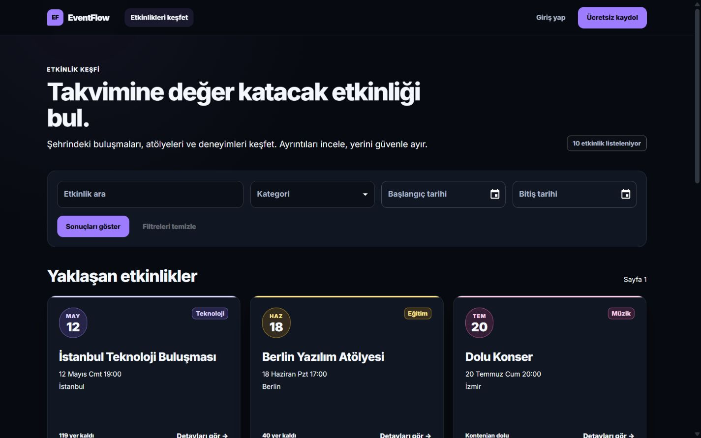
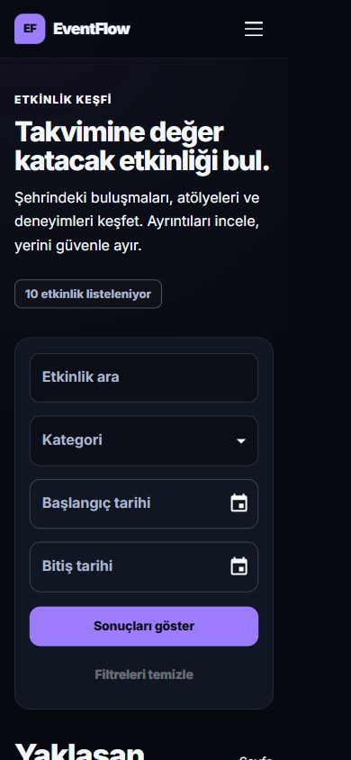
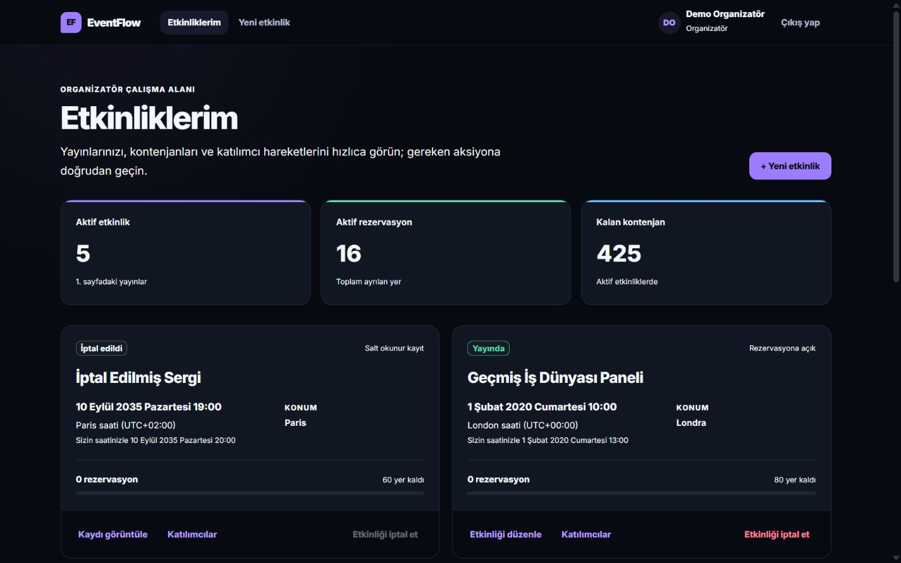
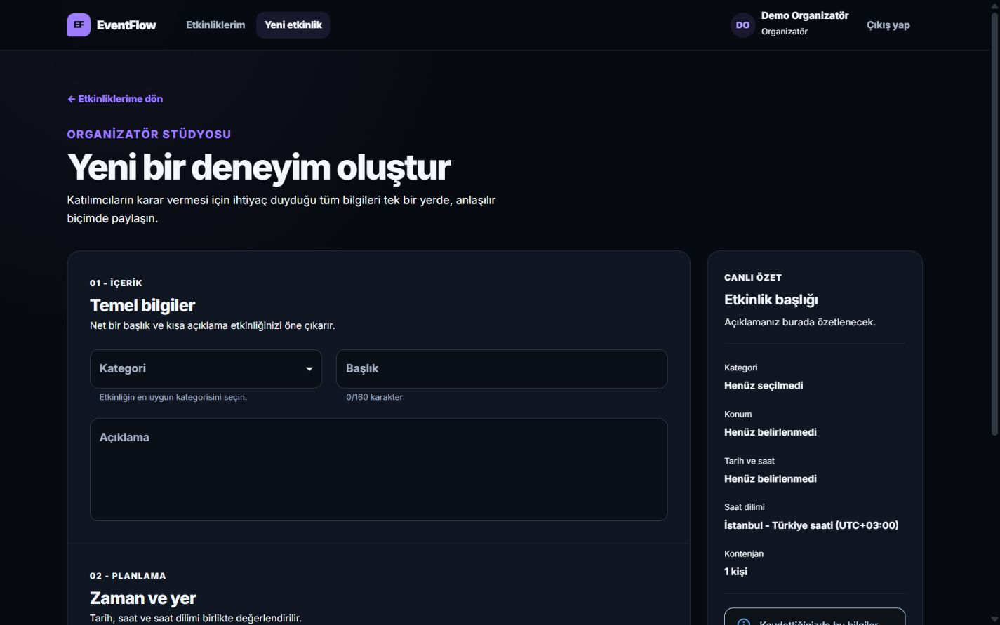

# EventFlow UI/UX yeniden tasarımı

EventFlow arayüzü, koyu temalı editoryal etkinlik platformu ile modern SaaS çalışma alanı karakterini birleştiren tek bir tasarım sistemiyle yenilendi. Backend iş kuralları, API sözleşmesi, kimlik doğrulama, idempotency ve sorgu davranışları değiştirilmedi.

## Tasarım yaklaşımı

- Tek koyu tema, azaltılmış gradyan kullanımı ve kontrollü kategori renkleri
- Merkezi renk, yarıçap, gölge, ölçü ve geçiş tokenları
- Klavye odağı, en az 44 piksel dokunma alanı ve azaltılmış hareket tercihi desteği
- Etkinlik saat dilimini birincil, farklıysa kullanıcının yerel saatini ikincil gösteren zaman sunumu
- Masaüstünde yoğun ama taranabilir, mobilde tek sütunlu ve kolay dokunulabilir bilgi mimarisi
- Yükleme, boş, hata, başarı, salt okunur ve onay durumları için tutarlı geri bildirim

## Yenilenen akışlar

- Etkinlik keşfi, filtreler, kategori renkleri, etkinlik kartları ve detay sayfası
- Giriş, kayıt ve açıklamalı hesap türü seçimi
- Katılımcı rezervasyon geçmişi, yeniden rezervasyon ve iptal onayı
- Organizatör özet metrikleri, etkinlik kartları ve iptal etkisi onayı
- Etkinlik oluşturma/düzenleme formu ve canlı özet
- Katılımcı listesinde masaüstü tablo ve mobil kart görünümü
- İptal edilen etkinlik ve rezervasyonlarda açıklayıcı, kimlik göstermeyen salt okunur durum

## Önce ve sonra

| Akış | Önce | Sonra |
| --- | --- | --- |
| Keşif - masaüstü | [Önce](screenshots/pr6-p1-event-search-desktop.png) | [Sonra](screenshots/ui-redesign-discovery-desktop.png) |
| Keşif - mobil | [Önce](screenshots/pr6-p1-event-search-mobile.png) | [Sonra](screenshots/ui-redesign-discovery-mobile.png) |
| Giriş - masaüstü | [Önce](screenshots/pr5-login-desktop.png) | [Sonra](screenshots/ui-redesign-login-desktop.png) |
| Organizatör çalışma alanı | [Önce](screenshots/pr5-organizer-events-desktop.png) | [Sonra](screenshots/ui-redesign-organizer-events-desktop.png) |
| Etkinlik formu - masaüstü | [Önce](screenshots/pr5-event-form-desktop.png) | [Sonra](screenshots/ui-redesign-event-form-desktop.png) |
| Etkinlik formu - mobil | [Önce](screenshots/pr5-event-form-mobile.png) | [Sonra](screenshots/ui-redesign-event-form-mobile.png) |

## Görsel örnekler

### Etkinlik keşfi - masaüstü

### Etkinlik keşfi - mobil

### Organizatör çalışma alanı

### Etkinlik formu - masaüstü

## Doğrulama kapsamı

- Frontend format, lint, TypeScript, 38 bileşen/birim testi ve production build
- E2E format, lint ve TypeScript kontrolü
- Production Compose üzerinde Desktop Chrome ve Pixel 7 profilleri
- Arama, kategori, yerel tarih filtreleri, organizatör-katılımcı yaşam döngüsü, saat dilimi kalıcılığı, sürüm çakışması, kapasite, iptal geçmişi ve ağ yanıtı kaybında idempotency
- 360x800, 390x844, 412x915, 768x1024, 1024x768, 1440x900 ve 1920x1080 taşma kontrolleri
- Mobil navigasyonda klavye odağı ve menü hedefleri doğrulaması
